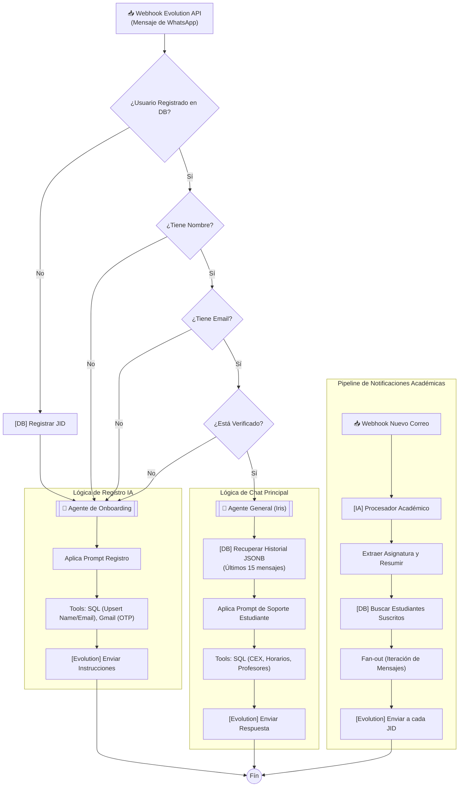

# Arquitectura Detallada de Iris 🪻

Iris opera mediante un flujo de ejecución continuo y ramificado basado en el estado del usuario. A continuación se detalla la lógica completa del sistema, desde la recepción del mensaje hasta la respuesta final.

## 🔄 Diagrama de Flujo Lógico (Ecosistema n8n)

## 📜 Descripción del Flujo

### 1. El Gatekeeper de Registro (Validación en Cascada)
Cada mensaje entrante pasa por un "embudo" de validaciones secuenciales. Si falta cualquier dato (Nombre, Email, OTP), el control se delega inmediatamente al **Agente de Onboarding**. Esto garantiza que no haya "huérfanos" en el sistema sin datos académicos vinculados.

### 2. Agentes con Herramientas
Los bloques `🤖` representan sub-procesos donde la IA toma el mando. Estos no son simples nodos de texto, sino **Agentes LangChain** que:
- **Consultan la Memoria**: Leen el `chat_history` en Postgres (usando el JID como llave).
- **Usan Herramientas**: Si el usuario pide un horario, el agente decide ejecutar un nodo de SQL. Si el usuario da su email, el agente llama al flujo de envío de código.

### 3. Pipeline de Notificaciones
Este flujo es independiente y se activa por eventos externos (Gmail). Utiliza una lógica de **Fan-out**:
- Identifica la asignatura.
- Busca quiénes están suscritos.
- Envía un mensaje sintetizado a cada uno.

## 🔗 Mapeo de Workflows n8n

| Bloque Lógico | Workflow n8n | Notas |
| :--- | :--- | :--- |
| **Orquestador Gatekeeper** | `Iris` / `Registro` | Controla los "If" de validación inicial. |
| **Agente General** | `[General] AI` | Maneja la conversación principal. |
| **Procesador Académico** | `Procesador Académico` | Se activa ante nuevos correos. |
| **Infraestructura MSG** | `enviar mensaje` | Sub-workflow para Evolution API. |
