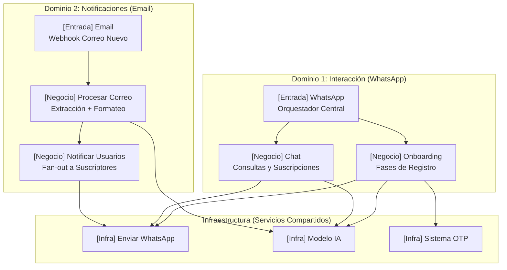

# Arquitectura Holística n8n — Iris 🪻

Iris no es solo un bot de WhatsApp; es un orquestador de información académica que conecta el correo institucional con el estudiante en tiempo real. Esta arquitectura de **3 capas** consolida todos los flujos siguiendo principios de **Clean Code (SRP, DRY, KISS)**.

---

## 🗺️ Mapa de Dominios

Iris se divide en dos grandes dominios funcionales apoyados por una capa de infraestructura común:



---

## 📥 DOMINIO 1: El Orquestador de WhatsApp (`Iris`)

Aplica el **Guard Clause Pattern** para una gestión limpia y eficiente de los usuarios de WhatsApp.

### Lógica de Control (Pseudocódigo)
```python
def main_wa_orchestrator(payload):
    # Guard 1: Ignorar mensajes propios
    if payload.fromMe: return

    # Guard 2: Datos limpios
    jid, msg = extract(payload)

    # Single DB Call: Estado del usuario
    user = db.get_user_state(jid)

    # Lógica de Onboarding Automática
    if not user:
        db.register_jid(jid)
        return start_onboarding(jid, msg, phase="nuevo")
    
    if not user.is_verified:
        phase = determine_phase(user)
        return start_onboarding(jid, msg, phase)

    # Usuario verificado -> Chat principal
    return start_chat(jid, msg)
```

---

## 📬 DOMINIO 2: El Pipeline de Notificaciones (Email → WA)

Este es el corazón de Iris: transforma correos corporativos en avisos útiles de WhatsApp.

### Flujo de Procesamiento Académico
1. **[Entrada] Email**: Recibe el webhook del servidor de correo. Guarda el crudo en `received_emails`.
2. **[Negocio] Procesar Correo**:
   - **Extracción**: Usa IA + Base de Datos de códigos para identificar la asignatura exacta del asunto.
   - **Reformulación**: El Agente IA aplica el prompt reformulador (de `PROMPTS.md`) para transformar el cuerpo del email en un resumen conciso y visual.
3. **[Negocio] Notificar Usuarios**:
   - Busca en `subject_subscriptions` a todos los usuarios `jid` suscritos a ese `subject_code`.
   - Realiza un **Fan-out**: Itera y envía el mensaje personalizado a cada uno vía `[Infra] Enviar WhatsApp`.

---

## 🛠️ Capa de Infraestructura (Services)

Para mantener los flujos de negocio limpios, todas las tareas técnicas se delegan:

- **`[Infra] Enviar WhatsApp`**: Encapsula la Evolution API. Maneja errores de envío y formatos.
- **`[Infra] Modelo IA`**: Centraliza la lógica de OpenRouter. Permite cambiar de modelo (ej: de `DeepSeek` a `Gemma`) en un solo lugar sin romper el resto del sistema.
- **`[Infra] Sistema OTP`**: Genera códigos de 6 dígitos, gestiona su expiración en DB y envía el correo vía Gmail para la verificación del Onboarding.

---

## 🧹 Plan de Consolidación de Workflows

### ✅ Workflows Core (El Nuevo Estándar)
1. `[Entrada] Iris` (WhatsApp Gateway)
2. `[Entrada] Nuevo Correo` (Email Gateway)
3. `[Negocio] Onboarding` (Registro guiado por fases)
4. `[Negocio] Chat Responder` (Atención al estudiante)
5. `[Negocio] Procesador Académico` (Extract + Format)
6. `[Negocio] Notificador Masivo` (Fan-out a suscritos)
7. `[Infra] Enviar Mensaje` (Evolution API wrapper)
8. `[Infra] Modelo IA` (OpenRouter wrapper)
9. `[Infra] Sistema OTP` (Gmail + DB Verification)

### 🗑️ Workflows a Eliminar (Deprecados)
- `flujo de registro`, `Registrar usuario`, `registrar correo`, `comprobar si un jid esta registrado`: Absorbidos por Onboarding.
- `enviar mensaje`: Renombrado a `[Infra] Enviar Mensaje`.
- `extraer modelos gratuitos`: Renombrado a `[Infra] Modelo IA`.
- `Redactor de texto`, `Extractor de asignatura`: Absorbidos por `[Negocio] Procesador Académico`.
- `Enviar mensaje por Código de Asignatura`: Absorbido por `[Negocio] Notificador Masivo`.

---

## 📊 Beneficios de este Rediseño holístico

| Dimensión | Antes | Después |
|---|---|---|
| **Mantenibilidad** | Lógica dispersa en 21 flujos | Centralizado en 9 flujos con responsabilidades claras |
| **Escalabilidad** | Dificultad para añadir nuevos canales | Capas separadas, fácil añadir Telegram o App |
| **Rendimiento** | Múltiples DB calls redundantes | Consultas indexadas y optimizadas (1 por flujo) |
| **Inteligencia** | Prompts básicos y hardcodeados | Sistema de prompts profesional y centralizado |
