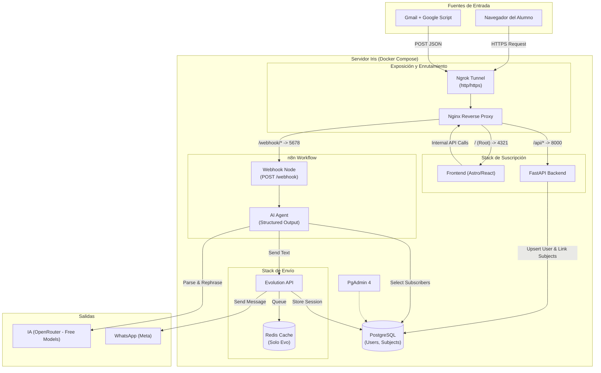

## Organización de Puertos

Para facilitar el desarrollo y evitar conflictos, se establece la siguiente asignación de puertos para los servicios en entorno local (Docker Host):

| Servicio          | Tecnología       | Puerto Interno (Container) | Puerto Externo (Host) | Descripción                                            |
| :---------------- | :--------------- | :------------------------- | :-------------------- | :----------------------------------------------------- |
| **Proxy**         | Nginx            | `80`                       | -                     | Reverse Proxy y Gateway principal (Acceso vía Ngrok).  |
| **Frontend**      | Astro + React    | `4321`                     | **10001**             | Interfaz de usuario web (Dev/Preview).                 |
| **Backend**       | FastAPI (Python) | `8000`                     | **10000**             | API REST principal.                                    |
| **Base de Datos** | PostgreSQL       | `5432`                     | **10004**             | Persistencia de datos relacional.                      |
| **Orquestador**   | n8n              | `5678`                     | **10002**             | Automatización de flujos y Webhooks.                   |
| **WhatsApp API**  | Evolution API    | `8080`                     | **10003**             | Gateway de WhatsApp.                                   |
| **Cache**         | Redis            | `6379`                     | -                     | Cola de mensajes y caché (Solo uso interno).           |
| **PgAdmin**       | PgAdmin 4        | `80`                       | **10005**             | Interfaz de administración de base de datos.           |
| **Ngrok**         | Ngrok            | `4040`                     | **10006**             | Túnel seguro exponiendo el **Proxy (Nginx)** al mundo. |

_Nota: Asegúrese de que estos puertos no estén ocupados por otros servicios en su máquina local antes de levantar el entorno. Los servicios marcados con "-" en el puerto externo no deben ser expuestos al host por seguridad o porque se accede a ellos a través de otro servicio (como Ngrok o Proxy)._
