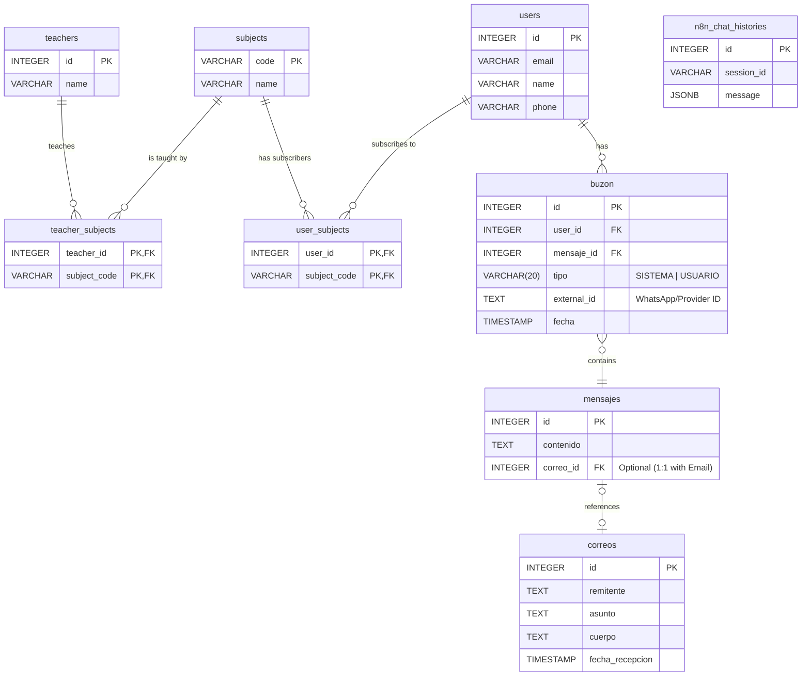

```mermaid
erDiagram
    %% --- ACADEMIC DOMAIN ---
    subjects {
        VARCHAR code PK
        VARCHAR name
    }

    teachers {
        INTEGER id PK
        VARCHAR name
    }

    teacher_subjects {
        INTEGER teacher_id PK, FK
        VARCHAR subject_code PK, FK
    }

    %% Relationships Academic
    teachers ||--o{ teacher_subjects : "teaches"
    subjects ||--o{ teacher_subjects : "is taught by"

    %% --- USER DOMAIN ---
    users {
        INTEGER id PK
        VARCHAR email
        VARCHAR name
        VARCHAR phone
    }

    user_subjects {
        INTEGER user_id PK, FK
        VARCHAR subject_code PK, FK
    }

    %% Relationships User
    users ||--o{ user_subjects : "subscribes to"
    subjects ||--o{ user_subjects : "has subscribers"

    %% --- COMMUNICATION DOMAIN ---
    %% (Reordered to influence layout: Buzon -> Mensajes -> Correos)

    buzon {
        INTEGER id PK
        INTEGER user_id FK
        INTEGER mensaje_id FK
        VARCHAR(20) tipo "SISTEMA | USUARIO"
        TEXT external_id "WhatsApp/Provider ID"
        TIMESTAMP fecha
    }

    mensajes {
        INTEGER id PK
        TEXT contenido
        INTEGER correo_id FK "Optional (1:1 with Email)"
    }

    correos {
        INTEGER id PK
        TEXT remitente
        TEXT asunto
        TEXT cuerpo
        TIMESTAMP fecha_recepcion
    }

    %% Relationships Communication
    %% Providing direction: User -> Buzon -> Mensajes -> Correos
    users ||--o{ buzon : "has"
    buzon }o--|| mensajes : "contains"
    mensajes |o--o| correos : "references"

    %% --- SYSTEM / LOGS ---
    n8n_chat_histories {
        INTEGER id PK
        VARCHAR session_id
        JSONB message
    }
```
