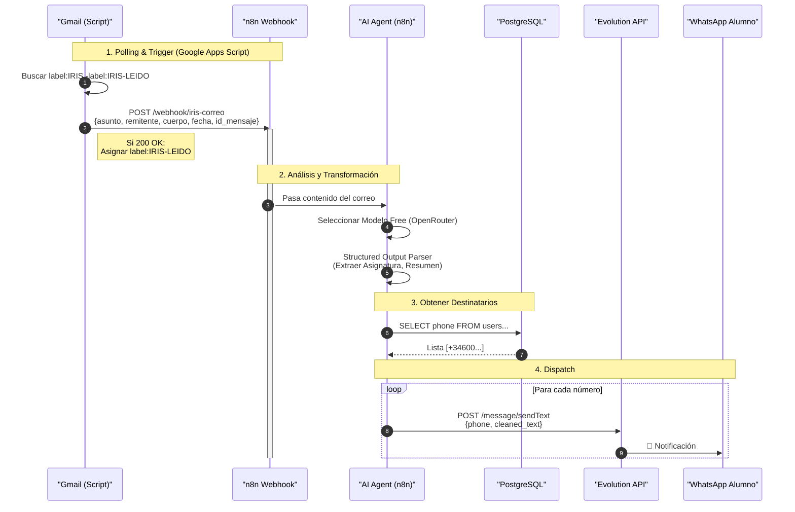

```mermaid
sequenceDiagram
    autonumber
    %% Actores
    participant Email as "Gmail (Script)"
    participant Webhook as "n8n Webhook"
    participant Agent as "AI Agent (n8n)"
    participant DB as "PostgreSQL"
    participant Evo as "Evolution API"
    participant Whatsapp as "WhatsApp Alumno"

    %% 1. Ingesta
    Note over Email, Webhook: 1. Polling & Trigger (Google Apps Script)
    Email->>Email: Buscar label:IRIS -label:IRIS-LEIDO
    Email->>Webhook: POST /webhook/iris-correo<br/>{asunto, remitente, cuerpo, fecha, id_mensaje}

    activate Webhook

    Note right of Email: Si 200 OK:<br/>Asignar label:IRIS-LEIDO

    %% 2. Proceso AI
    Note over Webhook, Agent: 2. Análisis y Transformación
    Webhook->>Agent: Pasa contenido del correo
    Agent->>Agent: Seleccionar Modelo Free (OpenRouter)
    Agent->>Agent: Structured Output Parser<br/>(Extraer Asignatura, Resumen)

    %% 3. Audiencia
    Note over Agent, DB: 3. Obtener Destinatarios
    Agent->>DB: SELECT phone FROM users...
    DB-->>Agent: Lista [+34600...]

    %% 4. Envío
    Note over Agent, Whatsapp: 4. Dispatch
    loop Para cada número
        Agent->>Evo: POST /message/sendText<br/>{phone, cleaned_text}
        Evo->>Whatsapp: 🔔 Notificación
    end

    deactivate Webhook
```
