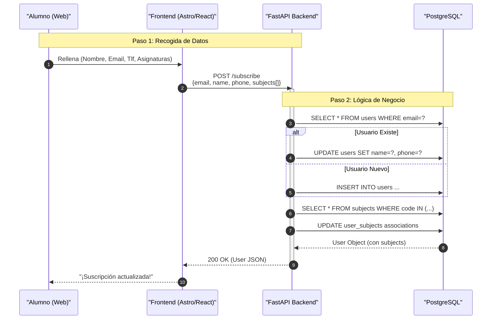

```mermaid
sequenceDiagram
    autonumber
    %% Actores
    participant User as "Alumno (Web)"
    participant Web as "Frontend (Astro/React)"
    participant API as "FastAPI Backend"
    participant DB as "PostgreSQL"

    Note over User, API: Paso 1: Recogida de Datos
    User->>Web: Rellena (Nombre, Email, Tlf, Asignaturas)
    Web->>API: POST /subscribe<br/>{email, name, phone, subjects[]}

    activate API
    Note over API, DB: Paso 2: Lógica de Negocio
    API->>DB: SELECT * FROM users WHERE email=?
    alt Usuario Existe
        API->>DB: UPDATE users SET name=?, phone=?
    else Usuario Nuevo
        API->>DB: INSERT INTO users ...
    end
    API->>DB: SELECT * FROM subjects WHERE code IN (...)
    API->>DB: UPDATE user_subjects associations

    DB-->>API: User Object (con subjects)

    API-->>Web: 200 OK (User JSON)
    deactivate API

    Web-->>User: "¡Suscripción actualizada!"
```
