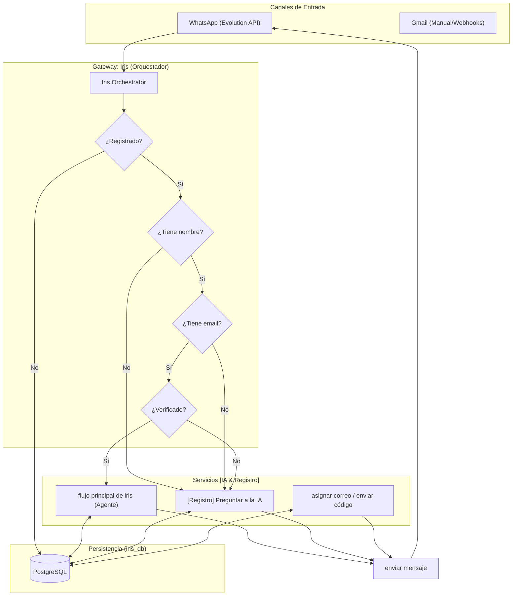
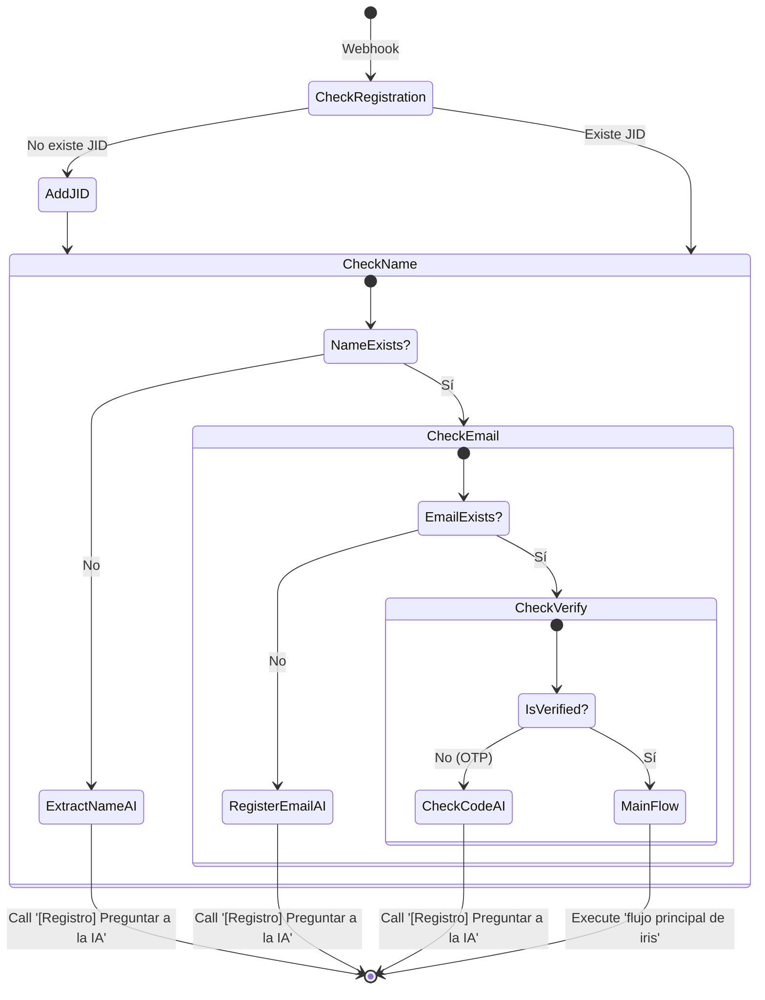
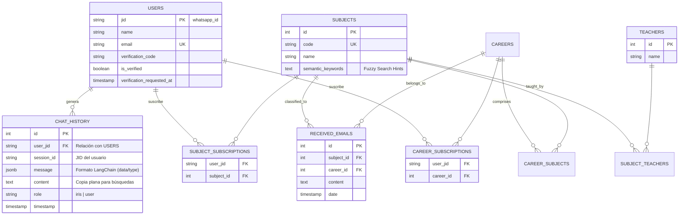

# Documentación de Iris 🪻

Bienvenido a la documentación técnica de Iris. Aquí encontrarás los detalles sobre la arquitectura del sistema, la lógica de los flujos de n8n y el diseño de la base de datos.

## 📌 Índice
1. [Arquitectura del Sistema](#-arquitectura-del-sistema)
2. [Lógica de Registro y Verificación](#-lógica-de-registro-y-verificación)
3. [Modelo de Datos](#-modelo-de-datos)

---

## 🏗️ Arquitectura del Sistema (Full Stack)

Iris opera bajo un modelo de orquestación centralizada que separa la lógica de validación de la lógica de negocio proactiva.

---

## 🔑 Lógica de Validación en Cascada

El sistema bloquea el acceso al `flujo principal de iris` hasta que el perfil del estudiante está completo y verificado.

---

## 📊 Modelo de Datos (Esquema Consolidado v2.2)

Iris utiliza un esquema relacional optimizado con **JID como clave primaria** y compatibilidad nativa para memorias de IA (LangChain).

> [!TIP]
> **Pruning Automático**: La tabla `chat_history` cuenta con un trigger (`prune_chat_history`) que mantiene automáticamente solo los últimos 15 mensajes por sesión para optimizar el rendimiento y el contexto de la IA.
