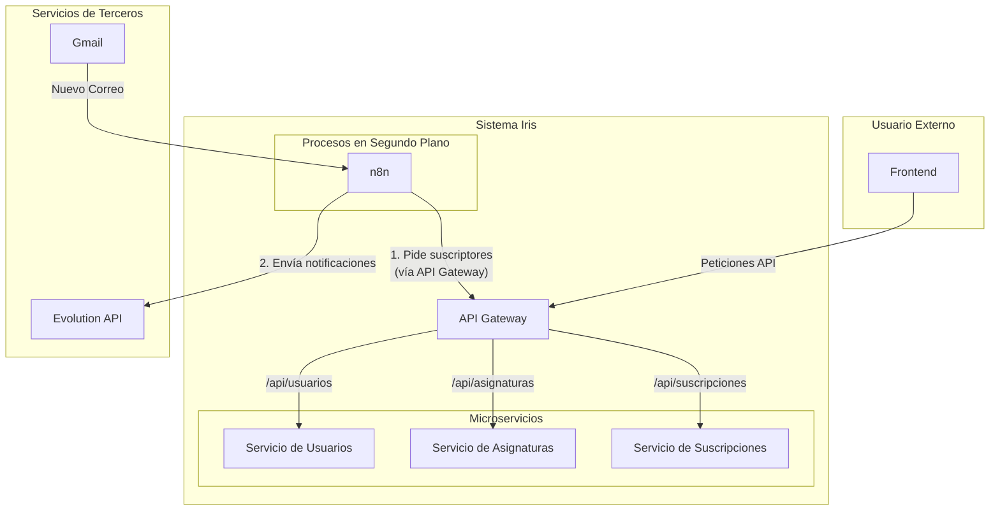

# Diseño de la Arquitectura del Sistema

Este documento describe la arquitectura de microservicios objetivo para el proyecto Iris, diseñada para ser escalable, mantenible y simple.

## Visión General

El sistema está diseñado como un conjunto de microservicios independientes y especializados que se comunican a través de APIs. Este enfoque permite el desarrollo, despliegue y escalado independiente de cada componente. Un API Gateway sirve como punto de entrada único para todo el tráfico externo, simplificando el frontend y centralizando responsabilidades comunes.

## Diagrama de Arquitectura

## Servicios Principales

### 1. API Gateway (Puerta de Enlace)
*   **Responsabilidad:** Actuar como el único punto de entrada público para todo el sistema.
*   **Función:**
    *   Recibe todas las peticiones entrantes del frontend.
    *   Enruta las peticiones al microservicio interno apropiado (ej: `/api/usuarios/*` va al Servicio de Usuarios).
    *   Gestiona aspectos transversales como la autenticación, el control de peticiones (rate limiting) y el registro de logs.

### 2. Servicio de Usuarios
*   **Responsabilidad:** Gestionar la identidad del usuario, la autenticación y los datos de perfil.
*   **Función:**
    *   Maneja el registro y el inicio de sesión de usuarios, específicamente usando Google OAuth para las cuentas de la universidad (`@alumnos.uneatlantico.es`).
    *   Proporciona endpoints de API para crear, leer, actualizar y eliminar datos de usuarios.
    *   Emite y valida tokens de autenticación (ej: JWTs).

### 3. Servicio de Asignaturas
*   **Responsabilidad:** Actuar como el catálogo maestro de todas las asignaturas disponibles.
*   **Función:**
    *   Expone un endpoint de API (ej: `GET /api/asignaturas`) para proporcionar una lista de todas las asignaturas.
    *   Cada asignatura se identifica por su clave de negocio única (el código oficial de la asignatura de la universidad).
    *   Esto permite al frontend mostrar dinámicamente las opciones de suscripción.

### 4. Servicio de Suscripciones
*   **Responsabilidad:** Gestionar la relación entre los usuarios y las asignaturas a las que están suscritos.
*   **Función:**
    *   Proporciona endpoints de API para crear, leer y eliminar suscripciones.
    *   Mantiene una correspondencia entre `id_usuario` y `codigo_asignatura`.
    *   Expone un endpoint de API interno para que otros servicios (como `n8n`) consulten todos los suscriptores de un `codigo_asignatura` específico.

### 5. n8n (Servicio de Orquestación)
*   **Responsabilidad:** Ejecutar el flujo de trabajo principal de correo a notificación.
*   **Función:**
    *   Consulta una cuenta de Gmail en busca de nuevos correos.
    *   Analiza (parsea) el correo para extraer el código único de la asignatura.
    *   **Crucialmente, no accede directamente a la base de datos.** En su lugar, llama a la API del Servicio de Suscripciones (`GET /api/suscripciones?codigo_asignatura=...`) para obtener la lista de usuarios suscritos.
    *   Itera sobre la lista y utiliza la Evolution API para enviar una notificación de WhatsApp a cada usuario.

## Decisiones Clave de Diseño

*   **ID de Asignatura:** Usaremos el código único de asignatura proporcionado por la universidad en sus correos como el identificador principal (`codigo_asignatura`) en todo el sistema. Esto evita mantener una correspondencia separada y simplifica la comunicación entre servicios.
*   **Comunicación vía API:** Toda la comunicación entre servicios (ej: entre `n8n` y el Servicio de Suscripciones) debe realizarse a través de APIs REST bien definidas, no compartiendo una base de datos. Esto asegura que los servicios estén desacoplados y puedan evolucionar de forma independiente.

## Diagrama de Flujo de Interacción

**Un usuario se suscribe a una asignatura:**
`Frontend -> API Gateway -> Servicio de Suscripciones`

**n8n procesa un correo:**
`Gmail -> n8n -> API Gateway -> Servicio de Suscripciones -> n8n -> Evolution API`
