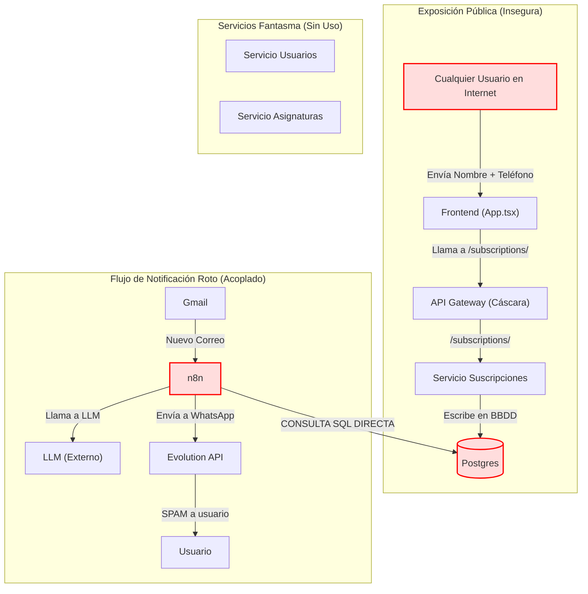
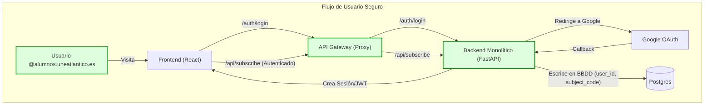
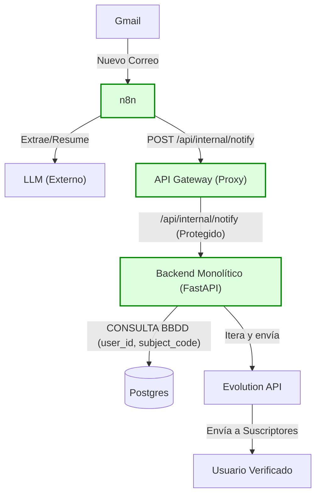
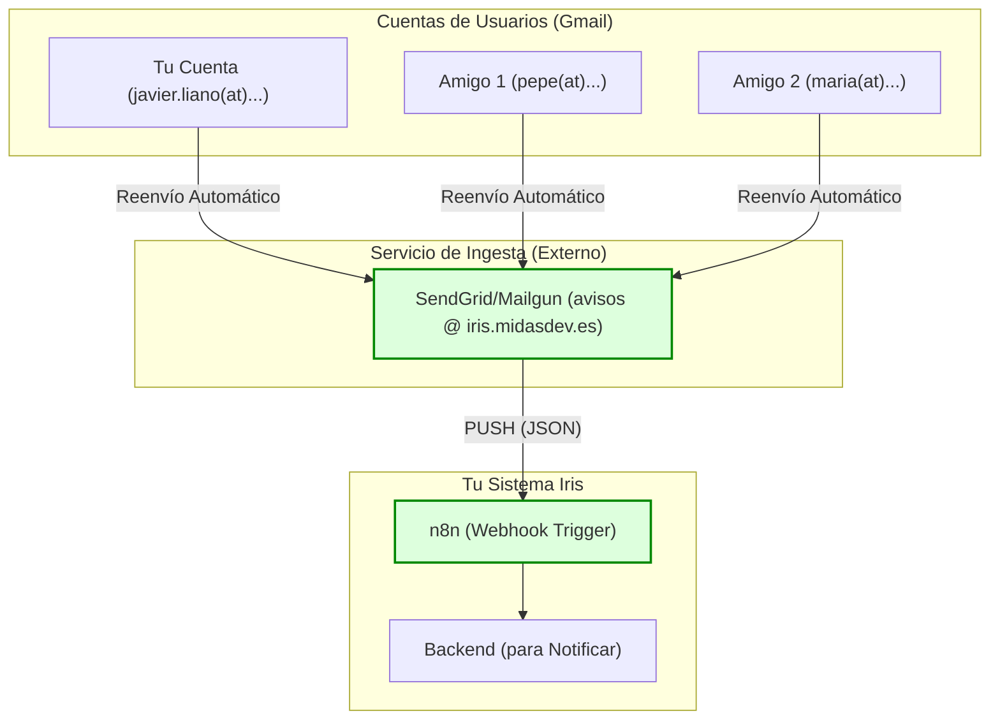

Fecha: 11 de noviembre de 2025

Has sido contratado para una evaluación directa y profesional. Aquí está mi auditoría de "sin filtros" sobre el proyecto Iris.

### 1. EVALUACIÓN CRÍTICA (LO MALO)

Tu proyecto está fundamentalmente roto en su arquitectura y representa un riesgo de seguridad crítico. La documentación describe una visión estratégica (un sistema de microservicios desacoplado) que la implementación real ignora por completo.

- **Fallo de Seguridad Crítico (Inyección de SPAM):** El frontend (`App.tsx`) permite que _cualquier persona_ en Internet introduzca _cualquier_ nombre y _cualquier_ número de teléfono (`'34' + whatsapp`) y los suscriba a notificaciones. No existe autenticación ni verificación del número. Puedo suscribir a miles de personas a recibir SPAM de "Bases de Datos I" ahora mismo. Esto no es un fallo menor, es una vulnerabilidad de nivel de producción que te expone a responsabilidades legales (GDPR, LOPD). El `servicio-usuarios` está vacío y no cumple su función documentada.
    
- **Conflicto Arquitectónico Fundamental:** Tu `architecture.md` establece explícitamente que `n8n` _no_ debe acceder a la base de datos directamente y debe comunicarse a través del API Gateway. El flujo de `n8n` (`iris.json`) hace exactamente lo contrario: ignora por completo los microservicios de backend y realiza consultas SQL directas a la base de datos de Postgres para `extraer codigos de clases`, `extraer destinatarios` y `Execute a SQL query`. Esto invalida todo el propósito de tu arquitectura de microservicios.
    
- **Microservicios "Fantasma":** Has creado una complejidad arquitectónica masiva para nada. Tienes tres servicios FastAPI (`servicio-usuarios`, `servicio-asignaturas`, `servicio-suscripciones`) que, en la práctica, no son utilizados por el núcleo de tu lógica de negocio (n8n). El `api-gateway` es un cascarón que solo devuelve un mensaje de bienvenida (aunque el frontend sí le apunta correctamente, la lógica de proxy no está implementada). Has construido un motor de coche (los servicios FastAPI) y lo has dejado en el garaje mientras empujas el chasis (n8n) a mano.
    
- **Dependencia Externa Frágil:** El cerebro completo de tu producto es una plantilla JSON (`iris.json`) que se ejecuta en n8n y depende de un modelo de LLM gratuito (`z-ai/glm-4.5-air:free`). Este modelo puede ser discontinuado, rate-limited o empezar a fallar mañana, y todo tu sistema colapsará. La lógica de negocio crítica (resumir, extraer) está fuera de tu control, es difícil de testear y no es robusta.
    
- **Escalabilidad Cero:** El producto está rígidamente acoplado a una sola fuente (`(vía UNEATLANTICO)`) y un solo formato de correo. Esto no es un producto escalable; es un script personalizado para una universidad. Si la universidad cambia el formato de sus correos, el proyecto muere.
    

### 2. PUNTOS DE VALOR (LO BUENO)

A pesar de los fallos críticos de ejecución, la base tiene potencial.

- **Identificación Clara del Problema:** El problema es real. Los correos universitarios son un caos y resumirlos para WhatsApp es una propuesta de valor tangible y excelente.
    
- **Fundamentos de DevOps Sólidos:** El proyecto está 100% containerizado. El uso de `docker-compose.yml`, la inicialización de la BBDD con `init-db.sh`, y los scripts de `backup`/`restore`/`safe-down` demuestran disciplina operativa.
    
- **Lógica Central Prototipada:** Millennials está en el lugar incorrecto (`n8n`), el flujo E2E (Email -> Extracción -> Resumen -> BBDD -> WhatsApp) está completamente definido y funcional. El _prompt engineering_ en el nodo "creador de mensajes" es detallado.
    
- **Frontend Limpio:** La interfaz de suscripción es moderna, limpia y cumple su objetivo simple.
    

### 3. PLAN DE ACCIÓN (LAS MEJORAS)

El rumbo debe corregirse de forma inmediata y radical.

1. **Implementar Autenticación (Prioridad Cero):** Detener todo. Implementar Google OAuth 2.0 en el `servicio-usuarios` enfocado a cuentas ` @alumnos.uneatlantico.es`, tal como se planeó. El `servicio-suscripciones` _solo_ debe operar sobre el `user_id` del usuario autenticado. El número de teléfono debe obtenerse del perfil de usuario verificado o validarse mediante un token (ej. SMS/WhatsApp). Eliminar la entrada de teléfono manual del frontend.
    
2. **Consolidar el Backend:** Eliminar los tres microservicios FastAPI (`usuarios`, `asignaturas`, `suscripciones`) y fusionarlos en **un solo** servicio FastAPI monolítico. La complejidad actual es un lastre sin beneficios. Este nuevo "backend" contendrá toda la lógica de API (auth, suscripciones, asignaturas).
    
3. **Hacer que el Gateway funcione:** Implementar un proxy inverso (ej. `fastapi-proxy`, Traefik, o Nginx) en el `api-gateway` para enrutar el tráfico: `/api/*` al nuevo backend monolítico y `/n8n/*` al servicio n8n. El frontend _solo_ debe hablar con el gateway.
    
4. **Refactorizar la Lógica de n8n:** El trabajo de n8n debe ser mínimo.
    
    - **Paso 1 (n8n):** Trigger de Gmail.
        
    - **Paso 2 (n8n):** Llamar al LLM para extraer código de asignatura y resumir.
        
    - **Paso 3 (n8n):** Enviar una _única_ petición `POST /api/internal/notify` a tu backend con el `subject_code` y el `resumen`.
        
    - **Paso 4 (Backend):** El endpoint `POST /api/internal/notify` (protegido) debe: 1. Consultar _su propia_ base de datos para obtener los teléfonos de los suscriptores. 2. Iterar y enviar los mensajes de WhatsApp.
        

Esto mueve la lógica de negocio crítica de un JSON (`iris.json`) a código Python testeable y mantenible.

### 4. DIAGRAMAS DE ARQUITECTURA (VISUAL)

Para clarificar los puntos anteriores, aquí están los diagramas de flujo de la arquitectura actual (rota) y la arquitectura propuesta (corregida).

#### A. Arquitectura Rota (Actual)

Este diagrama muestra cómo `n8n` ignora los microservicios y accede directamente a la BBDD, mientras el `api-gateway` y los servicios de backend están infrautilizados y existe un fallo de seguridad crítico.

#### B. Arquitectura Corregida (Recomendada)

Este diagrama muestra la consolidación en un único backend, un API Gateway funcional que actúa como único punto de entrada, y la implementación de autenticación.

#### C. Flujo de Notificación Corregido (Recomendado)

Este diagrama muestra cómo `n8n` se desacopla de la base de datos y la lógica de negocio, delegando la notificación al backend a través de una API interna segura.

### 5. ACLARACIÓN: Cómo "Mezclar" Ingesta y Crecimiento de Plantilla (El Camino Correcto)

Implementa la arquitectura "Push" (SendGrid/Mailgun + Webhook) una vez, y haz que _todos_ tus usuarios (tú y tus amigos) la alimenten.

1. **Configuras SendGrid/Mailgun** para recibir correos en `avisos @iris.midasdev.es` (ejemplo).
    
2. **Configuras SendGrid** para reenviar todo lo que recibe como un JSON a tu **Webhook de n8n**.
    
3. **Tú** (javier.liano @...) creas una **regla de reenvío automático** en tu Gmail de la universidad hacia `avisos @iris.midasdev.es`.
    
4. **Tus amigos** (pepe @..., maria @...) hacen **exactamente lo mismo**: crean una regla de reenvío automático en _sus_ cuentas hacia `avisos @iris.midasdev.es`.
    

**Resultado:** Tu sistema recibe correos en tiempo real de _todas_ las asignaturas de _todos_ tus usuarios _automáticamente_. Tu "plantilla" crece sin que nadie tenga que hacer nada manualmente.

#### Flujo de Ingesta Escalable (Recomendado)

### 6. DIRECCIÓN ESTRATÉGICA (VISIÓN PROFESIONAL)

**Veredicto:** Tienes un prototipo funcional envuelto en una arquitectura de nivel empresarial fallida. El proyecto sufre de "sobre-ingeniería" en las áreas equivocadas (microservicios innecesarios) y de "sub-ingeniería" en las críticas (seguridad, acoplamiento de lógica de negocio).

**Dirección:** **Pivotar de "Demo Tecnológica" a "Producto Mínimo Viable (MVP) Monolítico y Seguro".**

1. **Parar de construir:** No añadas más servicios (Redis, etc.) que no estás usando.
    
2. **Consolidar y Asegurar:** Ejecuta el Plan de Acción (puntos 1 y 2) inmediatamente. La seguridad no es negociable.
    
3. **Refactorizar (Punto 4):** Mueve la lógica de negocio fuera de n8n y ponla en tu código.
    
4. **Validar:** Tu único objetivo debe ser tener 10 usuarios reales de UNEATLANTICO usando esto de forma segura y estable.
    

Este proyecto tiene valor, pero actualmente es una casa construida sobre cimientos de paja. Has demostrado que puedes construir los componentes, ahora demuéstrame que puedes ensamblarlos correctamente, de forma segura y robusta. Deja de jugar con microservicios y n8n como si fueran bloques de Lego y construye un producto real.